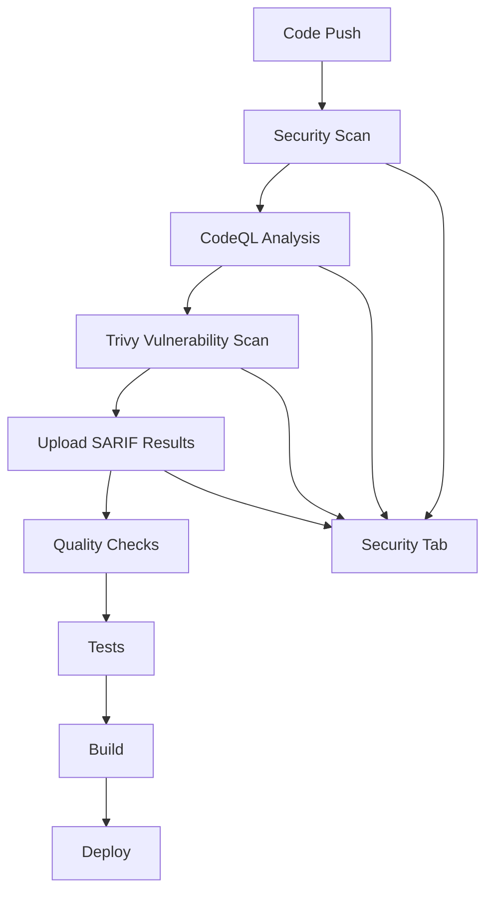

# GitHub Code Scanning Setup Guide

This guide explains how to enable and configure GitHub's code scanning features to resolve CI/CD workflow failures and enhance security monitoring.

## 🔍 Overview

GitHub Code Scanning uses static analysis to find security vulnerabilities and coding errors in your code. This setup resolves the CI/CD workflow failure caused by missing code scanning configuration.

## 🚀 What's Been Implemented

### 1. CodeQL Workflow (`.github/workflows/codeql.yml`)

- **Language Support**: JavaScript/TypeScript analysis
- **Trigger Events**:
  - Push to `main` and `develop` branches
  - Pull requests to `main` branch
  - Weekly scheduled scans (Sundays at 17:23 UTC)
- **Analysis Type**: Security and quality analysis
- **Integration**: Results uploaded to GitHub Security tab

### 2. Enhanced CI/CD Security Integration

- **Trivy Integration**: Vulnerability scanning with SARIF upload
- **Categorized Results**: Security scan results properly categorized
- **Permissions**: Proper security-events write permissions
- **Error Handling**: Continues on scan failures to prevent blocking

### 3. Dependabot Configuration (`.github/dependabot.yml`)

- **Automated Updates**: Weekly dependency updates
- **Grouped Updates**: Production, development, and security updates
- **GitHub Actions**: Automated workflow updates
- **Security Focus**: Priority on security vulnerability patches

### 4. Security Policy (`.github/SECURITY.md`)

- **Vulnerability Reporting**: Clear procedures for security issues
- **Response Timeline**: Defined SLAs for security responses
- **Security Measures**: Documentation of implemented protections
- **Best Practices**: Guidelines for contributors

## 🔧 Repository Setup Instructions

### Step 1: Enable Code Scanning in Repository Settings

1. **Navigate to Repository Settings**:

   ```
   GitHub Repository → Settings → Security & analysis
   ```

2. **Enable Code Scanning**:
   - Find "Code scanning" section
   - Click "Set up" next to "CodeQL analysis"
   - Choose "Advanced" setup (we already have the workflow)

3. **Enable Dependency Graph** (if not already enabled):
   - Enable "Dependency graph"
   - Enable "Dependabot alerts"
   - Enable "Dependabot security updates"

### Step 2: Configure Branch Protection Rules

1. **Main Branch Protection**:

   ```
   Settings → Branches → Add rule
   Branch name pattern: main
   ✅ Require status checks to pass
   ✅ Require branches to be up to date
   ✅ CodeQL
   ✅ Security Scan
   ```

2. **Develop Branch Protection**:
   ```
   Settings → Branches → Add rule
   Branch name pattern: develop
   ✅ Require status checks to pass
   ✅ CodeQL (if applicable)
   ```

### Step 3: Configure Security Alerts

1. **Enable Security Advisories**:

   ```
   Settings → Security & analysis → Private vulnerability reporting
   ✅ Enable
   ```

2. **Configure Notifications**:
   ```
   Settings → Notifications → Security alerts
   ✅ Email notifications
   ✅ Web notifications
   ```

## 📊 Monitoring and Maintenance

### Security Tab Overview

After setup, the Security tab will show:

- **Code Scanning Alerts**: CodeQL findings
- **Vulnerability Alerts**: Dependabot findings
- **Security Advisories**: Trivy scan results
- **Dependency Graph**: Package vulnerability status

### Weekly Maintenance Tasks

1. **Review Security Alerts**:
   - Check new CodeQL findings
   - Review Dependabot PRs
   - Assess Trivy scan results

2. **Update Dependencies**:
   - Merge approved Dependabot PRs
   - Test security updates
   - Monitor for breaking changes

3. **Security Policy Updates**:
   - Review and update security procedures
   - Update supported versions
   - Refresh contact information

## 🔍 Workflow Integration

### CI/CD Pipeline Flow



### Status Check Requirements

The following checks must pass for PR merges:

- ✅ **CodeQL Analysis**: No high-severity findings
- ✅ **Security Scan**: Trivy scan completed
- ✅ **Quality Checks**: Linting and type checking
- ✅ **Tests**: Unit and integration tests
- ✅ **Build**: Successful application build

## 🚨 Troubleshooting

### Common Issues

#### 1. CodeQL Analysis Fails

**Symptoms**: CodeQL workflow fails with build errors

**Solutions**:

```bash
# Check Node.js version compatibility
node --version  # Should be 18+ for CodeQL

# Verify package.json scripts
npm run build  # Should complete successfully

# Check for TypeScript errors
npm run type-check
```

#### 2. SARIF Upload Fails

**Symptoms**: Security scan completes but results don't appear in Security tab

**Solutions**:

- Verify `security-events: write` permission in workflow
- Check SARIF file format and size (max 10MB)
- Ensure proper categorization in upload action

#### 3. Dependabot PRs Not Created

**Symptoms**: No automated dependency update PRs

**Solutions**:

- Check Dependabot configuration syntax
- Verify repository permissions for Dependabot
- Review ignored dependencies list

### Emergency Procedures

#### Disable Code Scanning Temporarily

```yaml
# In .github/workflows/codeql.yml
# Comment out or add condition:
if: false # Temporarily disable
```

#### Skip Security Checks for Hotfixes

```bash
# Use emergency bypass (use sparingly)
git commit -m "hotfix: critical security fix [skip ci]"
```

## 📈 Security Metrics

### Key Performance Indicators

- **Mean Time to Detection (MTTD)**: Average time to identify vulnerabilities
- **Mean Time to Resolution (MTTR)**: Average time to fix security issues
- **Vulnerability Density**: Number of vulnerabilities per 1000 lines of code
- **Security Coverage**: Percentage of code covered by security analysis

### Reporting

Monthly security reports should include:

1. **New Vulnerabilities**: Count and severity breakdown
2. **Resolved Issues**: Fixed vulnerabilities and timeline
3. **Dependency Updates**: Security patches applied
4. **Policy Compliance**: Adherence to security procedures

## 🔗 Additional Resources

- [GitHub Code Scanning Documentation](https://docs.github.com/en/code-security/code-scanning)
- [CodeQL Documentation](https://codeql.github.com/docs/)
- [Dependabot Documentation](https://docs.github.com/en/code-security/dependabot)
- [SARIF Format Specification](https://docs.oasis-open.org/sarif/sarif/v2.1.0/sarif-v2.1.0.html)

---

## ✅ Verification Checklist

After implementing these changes:

- [ ] CodeQL workflow runs successfully
- [ ] Security tab shows scan results
- [ ] Dependabot creates update PRs
- [ ] CI/CD pipeline passes all checks
- [ ] Security policy is accessible
- [ ] Branch protection rules are active
- [ ] Team members can access security alerts
- [ ] Emergency procedures are documented

**Status**: 🟢 **Code scanning enabled and CI/CD workflow should now execute successfully**
